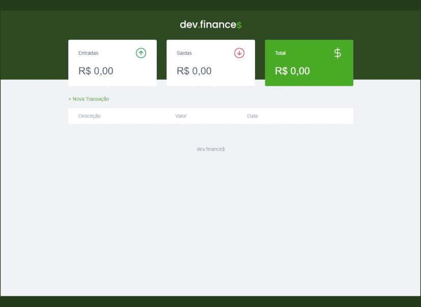

<p align="center">
  <a href="https://devfel.com/" rel="noopener">
 </a>
</p>

<h1 align="center">Control Your Finances </h1>
<h3 align="center"> 🔗 Test here: https://devfel.github.io/financas-front-only/ </h3>

<div align="center">

[]()
[](/LICENSE)

</div>

---

<p align="center"> 
In this <b>responsive</b> HTML, CSS and JavaScript application I created a simple finances control app that can be used by anyone to check their expenses and incomes. All the data is saved within the browser Local Storage and no database is included nor needed.</p>
</p>

  <p align="center">
    </a>
  </p>

---

## 📝 Table of Contents

- [Test Here](#live)
- [Application Features](#features)
- [Getting Started](#getting_started)
- [Dependencies](#dependencies)
- [Built Using](#built_using)
- [Acknowledgements](#acknowledgements)
- [Licenses](#licenses)
- [Authors](#authors)

---

## 🕹 Test Here <a name = "live"></a>

https://devfel.github.io/financas-front-only/

---

## 🧐 Application Features <a name = "features"></a>

- **_Add Expenses/Incomes:_** Button to show a modal where the user can add a expense or a income. To indicate an expense the user can simple add a negative sign before the value (Ex. -500).
- **_Button to Remove Data_** Button to remove any expense or income previosly added by the users.
- **_Show Totals_** Interface that shows the total of incomes, expenses and also the total ammount available.
- **_Show Individual Values_** Table to show every item added by the user indicating if it an expense or an income value.

---

## 🏁 Getting Started <a name = "getting_started"></a>

Because this was done using only HTML, CSS and JavaScript it can be replicated easily within your own browser without much trouble, just clone the project and you can run it with in your browser.

You can clone the repository through Command Prompt or Terminal just by typing:

```sh
git clone https://github.com/devfel/financas-front-only.git
```

or download the zip from the green **"Code"** button.

---

## 🔁 Dependencies <a name = "dependencies"></a>

No depencies needed. This project was done with Vanilla JS.

---

## ⛏️ Built Using <a name = "built_using"></a>

- [JavaScript](https://www.javascript.com/) - Programming Language
- [HTML](https://pt.wikipedia.org/wiki/HTML) - Markup Language
- [CSS](https://en.wikipedia.org/wiki/CSS) - Style Sheets

---

## 🎉 Acknowledgements <a name = "acknowledgements"></a>

- Project done based on the [Maratona Discover](https://maratonadiscover.rocketseat.com.br/maratona) course promoted by Mayk from the RocketSeat team.

---

## 📝 Liceses <a name = "licenses"></a>

- Distributed under the MIT License - see the [LICENSE.md](https://github.com/devfel/financas-front-only/blob/master/LICENSE.md) file for details.

---

## ✍️ Author <a name = "authors"></a>

- [@devfel](https://devfel.com/) - Luiz Flávio Felizardo
